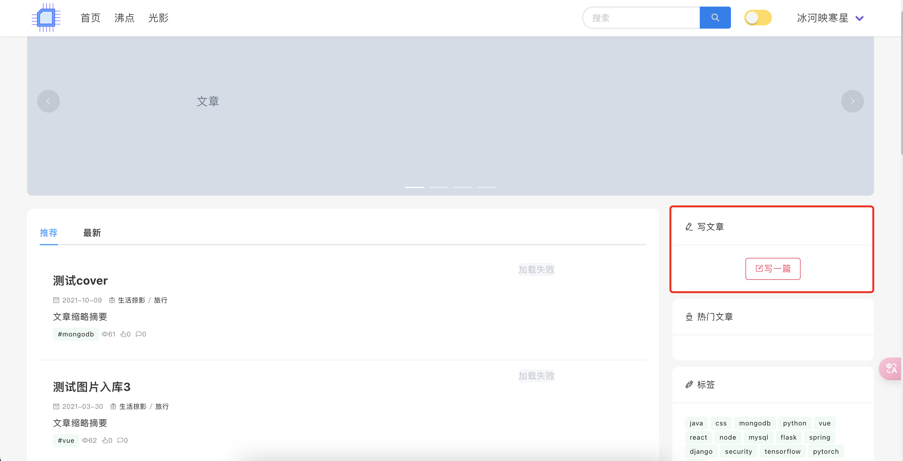

<div align="center">

<h2> Community-Blog</h2>
<p>一套前后端分离的社区博客分享系统，采用RESTFul风格构建。<p/>     

</div>

欢迎`star`&`fork`，欢迎`issue`讨论，欢迎`fork`&`pull request` 

## 1. 简介
（项目在[豆宝社区](https://github.com/songboriceman/doubao_community_frontend)基础上进行前后端优化开发）  

+ 前端页面改版重构
+ 优化搜索标签等功能
+ 优化文章发布流程，支持分类、标签等
+ 优化评论功能
+ 新增沸点页面，仿掘金，后续继续完善开发
+ 新增图片瀑布流页面，可上传图片、从文章中读取图片

具体可见**4. 页面预览截图**

## 2. 本地开发调试

MacOS环境下需安装好node.js、java、mysql等环境

### 2.1 mysql配置
```shell
brew install mysql
brew services start mysql
mysqladmin -u root password 'rootroot'

mysql -u root -p rootroot
mysql> create database community
mysql> use community;
mysql> source [路径]/community_backend/community.sql
```

### 2.2 后端服务启动
```shell
cd community_backend/target
java -jar community-0.0.1-SNAPSHOT.jar spring.profiles.active=dev
```  


### 2.3 前端启动
```shell
cd community_frontend
npm install
npm run serve
```


## 3. 服务器开发

### 3.1 环境配置
可参考`build_environment.sh`  
包含项目目录创建、java环境、mysql环境、nginx等 
```shell
mkdir -p /data/services/CommunityFrontendServer
mkdir -p /data/services/CommunityServer
mkdir -p /data/images/
mkdir -p /data/resource/
```

### 3.2 前端打包
```shell
$ npm run build
$ tar -czvf dist.tar.gz dist/*
```
上传服务器地址`/data/services/CommunityFrontendServer`并解压

### 3.3 jar包上传
### 3.4 nginx配置及启动
参考`nginx.conf`
```shell
sudo yum -y install nginx
sudo systemctl enable nginx
sudo service nginx start

systemctl restart nginx
```


## 4. 项目页面预览

#### 首页


#### 沸点


#### 图片瀑布流


#### 标签/搜索


#### 写作

